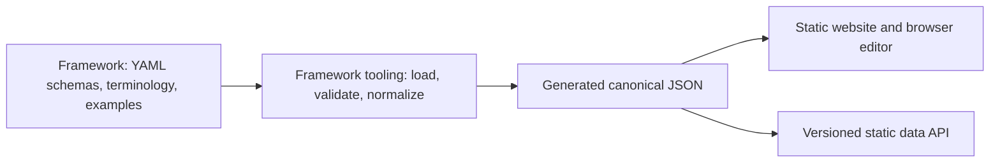

# VisContext product and implementation plan

Status: revised proposal, 22 June 2026

**VisContext is a temporary project name.** The research contribution includes
discovering the conceptual framework, its structure, and its vocabulary. The
software must therefore treat names, sections, fields, and ordering as data—not
as assumptions hard-coded into the website.

This revision also adopts a backend-free core. The framework and public records
live in Git, the website is generated as static files, and GitHub Pages can host
the complete public reading experience without a paid database or application
server.

## 1. Product objective

The project will provide an open way to publish and inspect structured context
about a visualization or visual story. It should help:

- authors disclose provenance, intent, methods, design decisions, uncertainty,
  limitations, and appropriate uses;
- readers understand and critically assess a visual without requiring expert
  knowledge of visualization research;
- researchers develop and evaluate a new conceptual framework for this
  contextual information;
- later, reviewers attach scoped assessments and evidence without turning the
  platform into an unsupported binary truth score.

The first product is not a social network, database service, or fact-checking
system. It is a framework, a small collection of example records, and a public
website that renders them.

## 2. What is stable and what is deliberately unstable

### Stable architectural concepts

Use neutral internal identifiers for concepts that the implementation needs:

- `framework`: a versioned definition of allowed record structures;
- `record`: one structured metadata document about a visual work;
- `section`: a modular group of fields inside a record;
- `field`: one defined metadata element;
- `work`: the visualization or visual story being described;
- `recordVersion`: an immutable published revision;
- `frameworkVersion`: the framework version against which a record validates.

These are machine-facing names, not proposed final research terminology.

### Deliberately unstable research concepts

- project and platform name;
- sheet, card, data card, metadata record, or another artifact name;
- names, definitions, number, and order of sections;
- required and optional fields;
- relationships between sections;
- field types and answer states;
- completeness and review concepts;
- which structures generalize across media, domains, and audiences.

The website must continue to build when these concepts are renamed, reordered,
added, or removed through framework files.

## 3. Terminology strategy

Use **VisContext** as the temporary platform name and **context record** as the
temporary public name for the structured artifact. Use **section** for a module.
These choices have no conceptual status.

All public terms belong in one versioned terminology file:

```yaml
project:
  name: VisContext
  description: Structured context for visual works

terms:
  record:
    singular: context record
    plural: context records
  section:
    singular: section
    plural: sections
  work:
    singular: visual work
    plural: visual works
```

Components refer to identifiers such as `terms.record.singular`; they do not
contain repeated strings such as “Visualization Sheet.” A future rename should
normally change this file, documentation, and URLs only where deliberately
chosen. Stable API property names should not be renamed for branding reasons.

## 4. Product and engineering principles

The platform should preserve the five principles in the research proposal:

1. **Flexible:** describe individual charts, interactives, dashboards, maps,
   videos, and multi-visual stories.
2. **Modular:** sections are self-contained and can be included when relevant.
3. **Extensible:** framework versions can add or reorganize concepts without
   invalidating previously published records.
4. **Accessible:** information supports overview and detail, keyboard and screen
   reader use, and plain-language explanations.
5. **Format-independent:** fields can support text, choices, links, citations,
   images, tables, and code references without making the framework dependent
   on one website.

Additional principles:

- The conceptual framework is a standalone research artifact.
- The website depends on the framework; the framework never depends on the
  website or a JavaScript UI component.
- Human authoring syntax and canonical exchange format are separate concerns.
- Published versions are citable and immutable. Corrections add versions.
- Claims, evidence, identity, completeness, and review remain separate.
- Public records are available as documented machine-readable files.
- A database is an optional storage adapter, not part of the framework.
- Accessibility, privacy, and governance are product requirements.

## 5. Framework/application boundary

The repository should contain three cleanly separated layers:



### Framework

The framework is a language-neutral collection of files. It defines semantics,
not components, CSS, routes, or database tables. It can be copied, cited,
archived, or implemented by another team without using the VisContext website.

### Framework tooling

A small TypeScript command-line tool loads YAML or JSON, validates it, resolves
references, checks framework-specific invariants, and emits normalized JSON.
Only this layer knows about source file formats.

### Website

The website reads normalized output through a `RecordRepository` interface. Its
initial implementation reads generated files at build time. A future database
or remote API implementation can satisfy the same interface without changing
the framework or page components.

## 6. File formats and schema strategy

### Recommended division of responsibilities

- **YAML:** human-authored framework configuration and example records;
- **JSON Schema Draft 2020-12:** formal structural validation;
- **JSON:** canonical generated representation and public data API;
- **Markdown:** long-form explanations where plain strings become unwieldy;
- **TypeScript:** validation tooling and website implementation only.

YAML is not the data model. It is the first authoring notation. YAML and JSON
both parse into the same data structure, so another loader can support TOML or a
visual editor later without redesigning the framework.

JSON Schema describes structural validity, but it should not carry every
editorial concern. Keep separate framework metadata for:

- display order and grouping;
- help text and examples;
- recommended input control;
- research rationale;
- requirement level and applicability guidance;
- terminology and translations.

This prevents a UI redesign from appearing to be a semantic schema revision.

### Proposed framework directory

```text
framework/
  README.md
  CHANGELOG.md
  framework.yaml
  terminology.yaml
  schemas/
    record.schema.yaml
    common/
    sections/
  presentation/
    default.yaml
  examples/
    placeholder/
      record.yaml
```

The first `framework.yaml` should contain one placeholder structure only. It is
not the preliminary “correct taxonomy.” Its purpose is to exercise iteration:

```yaml
id: viscontext-framework
version: 0.1.0
status: experimental
recordSchema: ./schemas/record.schema.yaml
terminology: ./terminology.yaml
presentation: ./presentation/default.yaml
sections:
  - id: overview
    schema: ./schemas/sections/overview.schema.yaml
```

### Schema evolution rules

- Framework versions use semantic versioning after `1.0.0`; before then, every
  version is explicitly experimental.
- Fields and sections have stable machine IDs independent of labels.
- Published records retain their original `frameworkVersion`.
- Old framework versions remain readable and archived in Git.
- A migration creates a new record version; it never rewrites old content.
- CI validates every example against its declared framework version.
- Valid and invalid fixtures document intended edge cases.
- Unknown, not applicable, not disclosed, and empty are different states only
  where the framework explicitly defines them.

## 7. Recommended technology stack

| Concern | Initial choice | Reason |
| --- | --- | --- |
| Framework source | YAML plus JSON Schema Draft 2020-12 | YAML is approachable for iterative editing; JSON Schema is an open, implementation-independent contract. |
| Canonical output | Generated JSON | Universally consumable and directly publishable as static API files. |
| Framework tooling | TypeScript CLI with a YAML parser and Ajv | Small, testable boundary between human files and all consumers. |
| Website | Astro in static-output mode | Designed for content-heavy static sites, generates one page per record, and deploys directly to GitHub Pages. |
| Interactive editor | React islands only where stateful interaction is needed | Keeps public reading pages mostly HTML while allowing a schema-driven browser editor later. |
| Styling | Plain CSS variables and repository-owned accessible components | Makes future rebranding and terminology changes cheap and avoids a large design-system dependency. |
| Search | Pagefind | Generates an in-browser search index from static HTML with no search server. |
| Validation | Ajv in the CLI, build, tests, and browser editor | One validation contract at every boundary. |
| Public API | Versioned static JSON files | Requires no running server and is generated from the same validated source as the pages. |
| Persistence | Git repository | Reviewable history, branching, attribution, rollback, and no database bill. |
| Drafts | Local files, Git branches/forks, and browser local storage | Drafts stay private to the author until intentionally submitted. |
| Publishing | Pull request merged to `main` | CI validates the framework or record and the merge triggers deployment. |
| CI and deployment | GitHub Actions and GitHub Pages | Fits this public repository and has no separate hosting service to operate. |
| Tests | Vitest, Playwright, and axe-core | Covers tooling, generated pages, browser editor behavior, and accessibility. |

Relevant primary documentation:

- [Astro deployment to GitHub Pages](https://docs.astro.build/en/guides/deploy/github/)
- [Astro React integration](https://docs.astro.build/en/guides/integrations-guide/react/)
- [GitHub Pages documentation](https://docs.github.com/en/pages)
- [GitHub Pages limits](https://docs.github.com/en/pages/getting-started-with-github-pages/github-pages-limits)
- [Pagefind static search](https://pagefind.app/)
- [JSON Schema Draft 2020-12](https://json-schema.org/draft/2020-12)
- [WCAG 2.2](https://www.w3.org/TR/WCAG22/)
- [C2PA specifications](https://spec.c2pa.org/specifications/specifications/2.3/index.html)

### GitHub Pages constraints

GitHub Pages is appropriate for the first non-commercial research platform, but
it is not unlimited storage. Current published limits include a recommended
1 GB source repository, a 1 GB published site, a 10-minute deployment timeout,
and a soft 100 GB monthly bandwidth limit. Therefore:

- store metadata and small optimized previews in Git;
- reference original visualizations, videos, datasets, and large media by URL;
- do not use Git LFS as an implicit media delivery system;
- monitor build time, site size, broken links, and bandwidth;
- preserve the ability to deploy the generated `dist/` directory to another
  static host without changing the application.

## 8. Static API and storage boundary

The build emits HTML and a versioned static data API:

```text
/api/v1/framework/index.json
/api/v1/framework/0.1.0.json
/api/v1/records/index.json
/api/v1/records/{record-id}.json
/api/v1/records/{record-id}/versions/{record-version}.json
```

API version and framework version are independent:

- `api/v1` describes URL and response conventions;
- `frameworkVersion` describes the conceptual metadata structure;
- `recordVersion` identifies a revision of one record.

The framework compiler emits these files from repository content. The website
does not define a second API model. A later live API can return the same objects.

Use an application boundary similar to:

```ts
interface RecordRepository {
  list(): Promise<RecordSummary[]>;
  get(recordId: string, version?: string): Promise<CanonicalRecord>;
}
```

The initial `GeneratedFileRecordRepository` reads build output. A future
`HttpRecordRepository` or `DatabaseRecordRepository` can be added without
changing record rendering.

## 9. Repository-backed records and versioning

Public records can use this structure:

```text
records/
  placeholder-record/
    record.yaml
    versions/
      0.1.0.yaml
```

`record.yaml` contains stable identity and the current published version.
Version files are immutable snapshots. Updating a record adds a version file and
changes the pointer. CI should reject modification or deletion of a published
version except through an explicit administrative process.

Git supplies history and review, but a GitHub account or commit does not prove
that a contributor created the visualization. Submission origin and creator
claims remain explicit record fields.

Small preview images may live beside a record. Original media stays at its
canonical source and includes rights, source, checksum where available, alt
text, and a long description.

## 10. Authoring without a backend

There are three incremental authoring modes.

### Mode A — Repository authoring

Researchers edit YAML, run local validation, and submit changes through Git.
This is sufficient for framework development and the first examples.

### Mode B — Browser editor with local output

A schema-driven editor runs entirely in the browser. It validates a record,
saves an unfinished draft in local storage, and downloads canonical YAML or
JSON. It does not require an account or transmit private drafts.

### Mode C — Repository publishing workflow

The contributor uploads the generated file through GitHub or submits a pull
request from a fork. Maintainers and CI review it before publication. This adds
no custom backend, but it creates friction for people unfamiliar with GitHub.

A browser cannot securely publish shared data, authenticate authors, keep
private cloud drafts, or moderate submissions without relying on some external
stateful service. If GitHub-based publishing proves too difficult for target
authors, later options are:

1. a small serverless gateway that creates pull requests;
2. a free-tier database/authentication service behind the repository interface;
3. a funded managed backend.

That decision should follow author testing. It should not be embedded in the
framework.

## 11. Placeholder framework and first example

Increment 0 should contain only enough structure to test the pipeline. Use one
temporary `overview` section with fields such as:

- title;
- short description;
- visual or canonical source URL;
- contributor display name;
- intended use;
- one known limitation.

These fields are placeholders, not a claim about the future taxonomy. The
example should use clearly fictional content or a properly licensed visual,
state that it exercises the software only, and carry framework version `0.1.0`.

The important test is whether a researcher can:

1. rename the artifact through `terminology.yaml`;
2. add, remove, or reorder a section through `framework.yaml`;
3. change a field through a section schema;
4. update the example;
5. run one command and see validation, generated JSON, and the website update.

No website component should require editing for these ordinary framework
changes.

## 12. Identity, evidence, and trust signals

The platform must not collapse several questions into “verified.” Track these
dimensions separately when the framework is ready to define them:

- submission origin: creator-submitted or third-party-submitted;
- identity status: declared, GitHub-associated, organization-linked, or checked
  under a documented future process;
- record completeness: applicable fields with responses;
- evidence coverage: claims with citations or supporting artifacts;
- review status: who reviewed what, under which rubric and framework version;
- disputes and corrections: visible state and resolution history.

The first release should not display a truth or quality badge. Any later signal
must expose its criteria, scope, evidence, issuer, date, and supersession rules.

## 13. Security, privacy, and accessibility

The backend-free design removes stored passwords, account profiles, and private
server data from the first release. It does not remove all risks.

- Treat every record and Markdown value as untrusted input during the build.
- Sanitize rendered Markdown and validate URLs.
- Do not allow raw HTML, scripts, executable uploads, or arbitrary iframes.
- Pin GitHub Action dependencies and minimize workflow permissions.
- Require pull-request review and passing validation before publication.
- Do not put sensitive or private research data in Git history.
- Document how corrections, takedowns, and contributor removal requests work.
- Target WCAG 2.2 AA, including keyboard operation, visible focus, semantic
  headings, accessible validation summaries, sufficient contrast, reduced
  motion, and text alternatives for visuals.
- Test generated pages with automated tools and manual keyboard and screen-reader
  checks.

If user accounts, analytics, or research instrumentation are later added, a
separate privacy and data-governance review becomes mandatory.

## 14. Incremental delivery plan

Each increment ends in a deployable vertical slice. The conceptual framework,
not user-account infrastructure, is the first risk to test.

### Increment 0 — Framework pipeline and one placeholder

Deliver:

- establish `framework/`, tooling, generated-output, and website boundaries;
- add central terminology and framework manifests;
- add one experimental section schema and one placeholder record;
- validate YAML against JSON Schema and emit canonical JSON;
- render the record generically in Astro;
- publish the static API files;
- add unit, build, accessibility smoke tests, and CI;
- deploy to GitHub Pages from `main`.

Exit condition: terminology, section order, and placeholder fields can change in
framework files without editing page components.

### Increment 1 — Framework workbench

Goal: make conceptual iteration fast and visible.

Deliver:

- framework reference pages generated from the schemas;
- valid and invalid fixtures with readable validation errors;
- visual comparison of two framework versions;
- a local watch command for schema, example, API, and site regeneration;
- several deliberately different research examples only when requested;
- an architecture decision record for versioning rules.

Exit condition: researchers can propose a framework change in a pull request and
inspect its generated documentation and examples before merging.

### Increment 2 — Public static catalog

Goal: validate records, relationships, and discovery without a database.

Deliver:

- record manifest and immutable version-file conventions;
- explore, detail, version, and framework pages;
- Pagefind search and static filters;
- stable URLs, metadata, sitemap, and JSON downloads;
- broken-link, site-size, and historical-version checks;
- representative records added through reviewed pull requests.

Exit condition: at least 10 diverse examples can be browsed, searched, linked,
validated, and exported within GitHub Pages limits.

### Increment 3 — Local browser editor

Goal: test schema-driven authoring with non-technical participants.

Deliver:

- generic fields generated from framework presentation metadata;
- accessible validation, conditional guidance, preview, and progress states;
- local autosave with explicit privacy messaging;
- YAML and JSON import/export;
- generated contribution instructions or pull-request package;
- author usability study focused on taxonomy gaps and terminology.

Exit condition: invited authors can complete and export a valid record without
editing YAML or receiving developer assistance.

### Increment 4 — Publishing and governance

Goal: accept external records without operating a custom backend.

Deliver:

- contribution templates and GitHub pull-request workflow;
- creator-submitted and third-party-submitted states;
- maintainers' moderation, correction, dispute, and appeals procedures;
- media, licensing, citation, and takedown policies;
- optional browser handoff to GitHub if it can be secure and usable.

Exit condition: target contributors can publish at an acceptable success rate,
and problematic submissions have documented handling paths.

### Increment 5 — Reassess persistence

Use evidence from Increment 4 to decide among:

- continuing with repository-backed publishing;
- adding a minimal serverless pull-request gateway;
- adding a database/authentication adapter;
- funding a managed service.

Only then consider comments, organization accounts, notifications, private cloud
drafts, structured reviews, or fact-checking workflows.

## 15. Research and product validation

Useful measures include:

- effort required to change the framework itself;
- frequency of website changes caused by framework changes;
- fields repeatedly marked unknown, not applicable, or not disclosed;
- disagreements over terminology, grouping, and missing concepts;
- author time and abandonment by section and field;
- reader success locating provenance, intended use, and limitations;
- change in interpretation after reading a record;
- ability to distinguish creator claims, sourced facts, and review findings;
- accessibility task completion with assistive technologies;
- contribution success for participants without GitHub experience.

Do not optimize for raw field completion. A concise, honest “unknown” can be more
useful than a filled field with low-quality text.

## 16. Repository structure

The clean separation justifies a small workspace from the beginning:

```text
apps/
  web/                    Astro website; consumes generated JSON only
framework/                language-neutral conceptual framework
records/                  versioned public record source files
packages/
  framework-tooling/      loader, validator, normalizer, generator
generated/                ignored local build output
tests/                    cross-layer fixtures and integration tests
docs/
  decisions/              architecture decision records
  implementation-plan.md
.github/workflows/        validation and GitHub Pages deployment
```

Dependencies flow in one direction:

```text
framework + records -> framework-tooling -> generated JSON -> web
```

The web application must not import internal tooling modules or read raw YAML.
The framework must not import anything from `apps/web` or `packages/`.

## 17. Decisions and questions not to overlook

Only the first question materially affects the post-prototype architecture.
None block Increment 0.

1. **Author publishing path:** Is a GitHub pull request acceptable for pilots,
   or must non-technical authors publish directly from the browser? A direct
   shared save requires some backend or third-party identity/persistence.
2. **Zero cost versus zero backend:** Is the requirement no monthly bill, no
   managed vendor, or no server-side component at all? These are different.
3. **Media ownership:** Will the platform host visuals or only metadata and
   optimized previews? Repository-backed hosting strongly favors the latter.
4. **Expected scale:** Approximate record count, update frequency, media volume,
   and traffic determine how long GitHub Pages remains appropriate.
5. **Public contribution policy:** Who may submit third-party records, and who
   resolves ownership disputes and takedowns?
6. **Framework governance:** Who approves taxonomy changes, and when does an
   experimental version become stable?
7. **Stable identifiers:** Should records eventually receive DOI-like persistent
   identifiers, or are project URLs and archived releases enough initially?
8. **Licensing:** Software, framework/specification, record metadata, and linked
   media need separate explicit licenses.
9. **Languages:** Should the framework support multilingual labels and values
   immediately, even if the initial website is English-only?
10. **Research boundary:** Which usage data, if any, may be collected, and under
    what consent and ethics process?

## 18. Next implementation slice

The next change should implement only Increment 0:

1. scaffold the workspace and Astro static site;
2. add `framework.yaml`, `terminology.yaml`, and one small schema;
3. add one placeholder YAML record;
4. build a validator and canonical JSON generator;
5. render the generated record without hard-coded section knowledge;
6. publish versioned static JSON beside the HTML;
7. add CI and GitHub Pages deployment.

No database, authentication, comments, badges, uploads, or production taxonomy
belongs in this slice. The success criterion is replaceability: changing the
temporary vocabulary or placeholder structure should be an ordinary data change,
not an application rewrite.
