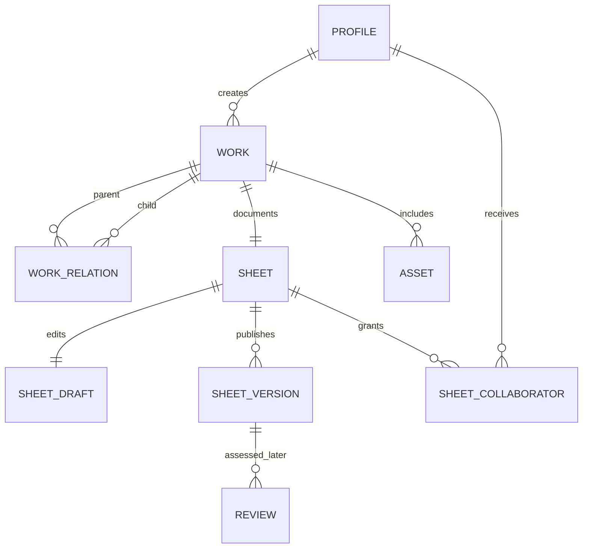

# VisContext product and implementation plan

Status: initial proposal, 22 June 2026

This document turns the current research and platform concept into an
incremental delivery plan. It is intentionally a draft: the taxonomy should be
tested with authors and readers before the platform hardens it into a database
or user interface.

## 1. Product objective

VisContext will let people publish and inspect structured context about a
visualization or visual story. It should help:

- authors disclose provenance, intent, methods, design decisions, uncertainty,
  limitations, and appropriate uses;
- readers understand and critically assess a visual without requiring expert
  knowledge of visualization research;
- researchers study which contextual information affects interpretation and
  trust;
- later, reviewers and fact-checkers attach scoped assessments and evidence
  without turning the platform into an unsupported binary truth score.

The first product is not a social network and not a fact-checking system. It is
a publishing and inspection tool for structured visualization metadata.

## 2. Product principles

The platform should preserve the five principles in the research proposal:

1. **Flexible:** describe individual charts, interactive visualizations,
   dashboards, maps, videos, and multi-visual stories.
2. **Modular:** cards are self-contained modules that can be included when
   relevant.
3. **Extensible:** schemas and card types are versioned and can evolve without
   invalidating existing published sheets.
4. **Accessible:** information supports overview and detail, keyboard and screen
   reader use, and plain-language explanations.
5. **Content-aware rather than format-bound:** fields can support text, choices,
   links, citations, images, tables, code references, and constrained embedded
   media. Arbitrary HTML is not accepted.

Additional engineering principles:

- Published records are citable and immutable. Corrections create a new
  version; they do not silently rewrite history.
- Claims, evidence, identity, completeness, and independent review are separate
  concepts in both the data model and interface.
- Public data can be exported in a documented, machine-readable format.
- The source code, schema, migrations, and decision records live in this
  repository. Managed infrastructure must remain replaceable.
- Accessibility, privacy, abuse prevention, and data governance are product
  requirements, not final-phase polish.

## 3. Shared vocabulary

Consistent names are important because several current terms overlap.

| Term | Meaning |
| --- | --- |
| **Work** | The thing being documented: either a visualization or a visual story. It has a stable identity and URL. |
| **Visualization** | An individual visual work, static or interactive. |
| **Visual story** | A narrative work containing or referring to one or more visualizations. |
| **Visualization Sheet** | The complete structured documentation associated with a work. |
| **Card** | A modular section within a sheet, such as Data, Usage, or Visual Encoding. |
| **Draft** | The mutable authoring state of a sheet. |
| **Published version** | An immutable snapshot of a sheet, including its schema version and publication metadata. |
| **Contributor** | A person or organization associated with a work or sheet in a stated role. |
| **Source** | A citation or external resource supporting a metadata entry or claim. |
| **Review** | A scoped assessment made by an identified reviewer under a stated process. |

Use **Visualization Sheet** for the whole artifact and **Card** only for one of
its modules. “Visualization Card” should not refer to both.

## 4. Scope of the first usable release

### Included

- public browse, basic search, and sheet detail pages;
- one stable record for each visualization or visual story;
- modular cards for Project, Usage, Data, Analysis, Visual Encoding,
  Interaction, and Uncertainty and Limitations;
- author sign-in and ownership;
- create, save, preview, and publish a sheet;
- an image or external canonical URL for the documented work;
- immutable publication history and change notes;
- source links and citations;
- JSON export of every published version;
- clear labels for creator-authored and third-party-submitted records;
- accessible responsive interfaces.

### Explicitly deferred

- public comments and discussion;
- crowdsourced fact-checking or expert verification;
- badges that imply truth, quality, or trustworthiness;
- educational activities and learning management features;
- arbitrary executable embeds;
- automated AI-generated assessments;
- video hosting or a general-purpose media pipeline;
- DOI minting, ORCID synchronization, C2PA signing, and federation;
- native mobile applications.

These are deferred because each adds substantial moderation, governance,
security, or research-design requirements. The underlying model will leave room
for them.

## 5. Recommended technology stack

Versions should be pinned when each implementation slice starts, then updated by
automated dependency pull requests. The architecture should not rely on an
unreleased framework feature.

| Concern | Choice | Reason |
| --- | --- | --- |
| Language | TypeScript | One typed language across browser, server, schemas, and tests lowers coordination cost. |
| Web application | Next.js App Router with React | Supports accessible server-rendered public pages, interactive authoring, route handlers, metadata, and incremental caching in one application. |
| Styling and components | Tailwind CSS plus a small repository-owned accessible component layer | Fast iteration without locking the product into a large visual design system. Prefer native controls and audited headless primitives where needed. |
| Canonical metadata definition | JSON Schema Draft 2020-12 | Open, language-independent validation; supports modular schemas and reuse outside this application. |
| Form handling | React Hook Form with a small custom field registry | Gives good validation and authoring ergonomics while allowing research-specific help, examples, conditional fields, and accessibility. Avoid a generic schema form UI as the permanent product interface. |
| Schema validation | Ajv on client and server | Uses the same committed JSON Schemas at both trust boundaries. Server validation remains authoritative. |
| Database | PostgreSQL | Strong constraints and relational links for authorship and versions, JSONB for evolving sheet content, and adequate built-in full-text search for the initial scale. |
| Backend services | Supabase, initially managed | Provides PostgreSQL, authentication, object storage, backups, and row-level security with a local development stack and versioned SQL migrations. It can be self-hosted or replaced later. |
| Database access | SQL migrations plus the Supabase TypeScript client | Keeps authorization in PostgreSQL Row Level Security and avoids duplicating the data model in an ORM migration layer. Generate database types in CI. |
| Search | PostgreSQL full-text search with GIN indexes | Sufficient for the initial catalog; add a dedicated search service only after measured relevance or scale problems. |
| Public API | Next.js route handlers described with OpenAPI 3.1 | Makes published sheets and versions retrievable by stable URL. JSON Schema components can be reused in the API description. |
| Tests | Vitest, Testing Library, Playwright, axe-core, and pgTAP for database policies | Covers schema logic, UI behavior, complete authoring flows, accessibility regressions, and authorization boundaries. |
| CI | GitHub Actions | Runs formatting, linting, type checks, schema checks, database tests, application tests, and production builds on every change. |
| Hosting | Node-compatible application host plus an EU-region Supabase project | Server rendering is important for public, citable records. Start with Vercel for operational simplicity but avoid Vercel-only persistence or business logic. |
| Monitoring | Structured application logs and privacy-preserving error reporting | Start with operational failures; add product analytics only with an explicit research and privacy plan. |

Why not use GitHub Pages as the application host: it serves static files only.
It can host project documentation or an initial static demonstration, but it
cannot provide server-rendered records, secure server operations, or the full
authoring workflow. The repository name does not require the final application
to run on GitHub Pages.

Relevant primary documentation:

- [Next.js App Router](https://nextjs.org/docs/app)
- [Supabase platform overview](https://supabase.com/docs/)
- [Supabase local development and migrations](https://supabase.com/docs/guides/cli/local-development)
- [Supabase Row Level Security](https://supabase.com/docs/guides/database/postgres/row-level-security)
- [PostgreSQL full-text search through Supabase](https://supabase.com/docs/guides/database/full-text-search)
- [JSON Schema Draft 2020-12](https://json-schema.org/draft/2020-12)
- [OpenAPI 3.1](https://spec.openapis.org/oas/v3.1.1.html)
- [WCAG 2.2](https://www.w3.org/TR/WCAG22/)
- [C2PA specifications](https://spec.c2pa.org/specifications/specifications/2.3/index.html)

## 6. Information architecture

The public navigation for the first release should stay small:

- **Explore:** browse and search published works;
- **About:** explain the framework, terminology, and limits;
- **Create:** start or continue a sheet after authentication;
- **Profile:** manage the user's own sheets and account.

A published sheet page should support two reading depths:

1. A summary with the visual, title, authorship status, purpose, last update,
   major limitations, and available cards.
2. Expandable or directly linked card sections with field-level sources,
   definitions, and interpretation guidance.

Each field needs a human-readable label, short help text, optional example,
expected input type, requirement level, and stable machine identifier. Do not
expose internal taxonomy jargon without a plain-language explanation.

## 7. Metadata and schema strategy

The taxonomy is still research output, so it must not be hard-coded into
database columns or page components.

### Canonical representation

Keep JSON Schemas in the repository. A sheet manifest references modular card
schemas. A separate UI configuration controls ordering, grouping, help text, and
widgets without changing validation semantics.

An illustrative published payload:

```json
{
  "schemaVersion": "0.1.0",
  "work": {
    "type": "visualization",
    "title": "Example climate visualization",
    "language": "en"
  },
  "cards": {
    "project": {},
    "usage": {},
    "data": [],
    "analysis": {},
    "visualEncoding": {},
    "interaction": {},
    "limitations": {}
  }
}
```

### Rules

- Use semantic versions for the public schema.
- Give every field a stable identifier independent of its displayed label.
- Mark fields as required only when a sheet would be misleading without them.
- Allow `notApplicable`, `unknown`, and `notDisclosed` where their meanings are
  genuinely distinct; never encode them as an empty string.
- Store language tags for translatable user content from the beginning, even if
  the first interface is English-only.
- Keep citations and supporting URLs attached to the field or claim they
  support, not only in a page-level bibliography.
- Commit valid and invalid fixtures for every card schema.
- Validate on input and again on publication.
- Published snapshots retain their original schema version. A migration creates
  a new draft; it never mutates an old version.

### Content types

Start with constrained types: short text, long Markdown text, choice, multiple
choice, date or date range, URL, citation, person or organization reference,
image reference, table, code repository reference, and structured scale or axis
descriptions. Render Markdown through an allowlist sanitizer. Do not accept raw
HTML, scripts, or arbitrary iframes.

## 8. Core data model

Use relational tables for identity, authorization, relationships, and discovery;
use a JSONB snapshot for the evolving sheet body. Do not build an entity-
attribute-value table for every metadata field.



Initial tables:

- `profiles`: public identity fields linked to the authentication provider;
- `works`: stable identity, type, slug, canonical source URL, submitter, claim
  status, visibility, and timestamps;
- `work_relations`: typed links such as `story_contains_visualization`,
  `is_version_of`, or `is_derived_from`;
- `sheets`: stable sheet identity and current published version pointer;
- `sheet_drafts`: one mutable JSONB document per sheet, schema version, and an
  optimistic locking revision;
- `sheet_versions`: immutable JSONB document, sequential version, schema version,
  content hash, publisher, publication time, and change note;
- `sheet_collaborators`: role-based write access;
- `assets`: storage key, media type, checksum, alt text, source, and rights data.

Organizations, comments, moderation cases, reviews, endorsements, and badge
evidence should be added only when their workflows are designed.

The content hash detects whether a snapshot changed. It does not prove that the
content or uploader is authentic. Cryptographically bound media provenance is a
later C2PA integration, not something to simulate with a database hash.

## 9. Identity, claims, and trust signals

The platform must not collapse several different questions into “verified.”

Track these dimensions separately:

- **Submission origin:** creator-submitted or third-party-submitted.
- **Identity status:** email confirmed, organization-linked, or externally
  identified through a future process.
- **Record completeness:** which applicable fields have responses.
- **Evidence coverage:** which claims have citations or supporting artifacts.
- **Review status:** who reviewed what, under which rubric, on which version, and
  when.
- **Disputes and corrections:** visible status and resolution history.

The first release may show a neutral completeness indicator. It must not label a
record truthful, reliable, safe, or high quality. Any later badge must have
clickable criteria, scope, evidence, issuer, date, and expiration or supersession
rules.

Third-party submissions need an explicit `unclaimed` state, prominent source
attribution, a creator claim process, and a report mechanism before public launch.

## 10. Security, privacy, accessibility, and operations

### Security

- Enable Row Level Security on every exposed table and test anonymous, owner,
  collaborator, moderator, and service-role boundaries.
- Treat server-side validation as authoritative even when the client validates.
- Restrict upload MIME types and sizes, verify file signatures, remove dangerous
  metadata where appropriate, and generate display derivatives.
- Sanitize Markdown and URLs; block executable uploads and arbitrary embeds.
- Add rate limits, email verification, bot protection, audit events for
  publication and role changes, and secure headers before opening registration.
- Keep secrets out of the repository and expose only the intentionally public
  Supabase client key.

### Privacy and governance

- Collect the minimum personal data needed for attribution and account use.
- Define controller, processors, retention periods, export, deletion, moderation,
  and research-consent boundaries before pilot participants create accounts.
- Choose EU data residency for the first hosted environment.
- Separate operational account data from research study data and consent.
- Back up the database and storage, and test restore procedures before beta.

### Accessibility

Target WCAG 2.2 AA. Include keyboard operation, visible focus, semantic headings,
form labels and instructions, accessible validation summaries, sufficient
contrast, reduced-motion support, media alternatives, alt text, and a meaningful
non-visual description of every uploaded visualization. Automated axe checks are
necessary but do not replace keyboard and screen-reader testing.

### Operations

Maintain local, preview, staging, and production environments. Database changes
are SQL migrations reviewed in Git. Production migrations run separately from
the web deployment and must be backward compatible during rollout.

## 11. Incremental delivery plan

Each increment ends in a deployable vertical slice with a clear exit condition.
Do not start community features while the schema and authoring workflow are still
unstable.

### Increment 0 — Schema and read-only exemplar

Goal: test the conceptual model without infrastructure.

Deliver:

- scaffold the Next.js TypeScript application;
- add the first JSON Schema (`0.1.0`) and UI configuration;
- create one realistic, complete example and several edge-case fixtures;
- render a responsive read-only sheet from the fixture;
- explain submission origin and the difference between completeness and review;
- add schema validation, unit tests, accessibility checks, and CI;
- deploy a preview.

Exit condition: researchers can change a schema or fixture in Git, CI validates
it, and non-project readers can navigate and understand the rendered example.

### Increment 1 — Public catalog backed by PostgreSQL

Goal: validate stable records, relationships, and discovery.

Deliver:

- local Supabase project and committed migrations;
- `works`, `work_relations`, `sheets`, `sheet_versions`, and `assets` tables;
- public read policies and seeded example records;
- explore, search, filter, detail, and version pages;
- server-rendered metadata and stable slugs;
- JSON download for published versions.

Exit condition: at least 10 diverse research fixtures—including a static chart,
map, dashboard, interactive, and visual story—can be imported, browsed, searched,
and exported without schema exceptions.

### Increment 2 — Author accounts and draft workflow

Goal: let invited authors publish their own sheets safely.

Deliver:

- passwordless authentication and profiles;
- owner and collaborator Row Level Security policies;
- create, autosave, resume, preview, and validation-summary flows;
- card-by-card authoring with conditional questions and examples;
- publish action producing an immutable version and content hash;
- basic image upload with alt text and rights fields;
- end-to-end tests for authorization and publishing.

Exit condition: invited pilot authors can complete and publish sheets without
developer assistance, and cannot read or modify another author's private draft.

### Increment 3 — Versioning, citations, and portability

Goal: make sheets maintainable and citable over time.

Deliver:

- change notes, version comparison, correction, and withdrawal states;
- field-level citations and link-health metadata;
- schema migration from an old draft to the current schema;
- complete JSON import and export, plus an OpenAPI-described read API;
- print stylesheet and a stable citation format;
- backup and restore exercise.

Exit condition: a published sheet can be corrected without losing its old URL or
history, and another implementation can consume its exported representation.

### Increment 4 — Third-party submissions and governance

Goal: support contextualization by people other than the original author.

Deliver only after policy and moderation design:

- unclaimed third-party records with source attribution;
- creator claim and conflict workflow;
- report, moderation queue, audit log, and appeals policy;
- organization roles and delegated maintainers;
- terms, privacy notice, acceptable-use policy, and retention schedule.

Exit condition: impersonation, disputed ownership, harmful content, and takedown
requests have documented and tested handling paths.

### Increment 5 — Discussion and scoped review

Goal: study public scrutiny and expert assessment without creating a generic
trust score.

Deliver:

- comments or questions attached to a specific sheet version and card;
- moderation controls, notifications, and abuse prevention;
- structured reviews with reviewer identity, expertise, rubric, evidence, scope,
  date, and status;
- transparent, separately rendered completeness, evidence, and review signals;
- research instrumentation approved under the relevant ethics and privacy plan.

Exit condition: users can understand exactly what was reviewed and can inspect
the supporting evidence and process.

### Increment 6 — Integrations and education

Potential later work:

- embeddable sheet summaries and criteria-based labels;
- ORCID and organization identity integrations;
- DOI or archival deposit workflows;
- C2PA credential inspection and, where justified, signing;
- learning activities tied to real records;
- notifications, multilingual interface, federation, and bulk institutional
  import.

Each is a separate product decision, not an assumed part of the core platform.

## 12. Research and product validation

Technology cannot answer whether the taxonomy is useful. Each increment should
include evaluation with representative authors and readers.

Useful measures include:

- time and abandonment by card and field;
- fields repeatedly marked unknown, not applicable, or not disclosed;
- reader success locating provenance, intended use, and limitations;
- change in interpretation after reading a sheet;
- ability to distinguish creator claims, sourced facts, and reviewer findings;
- disagreements over terminology and missing card types;
- accessibility task completion with assistive technologies;
- search success across domains and media types.

Do not optimize for raw field completion. A concise, honest “unknown” can be more
useful than a filled field with low-quality text.

## 13. Repository and delivery conventions

Start as one application, not a monorepo:

```text
app/                    Next.js routes and layouts
components/             shared accessible UI
features/               product workflows by domain
schemas/                JSON Schemas, UI configuration, fixtures
lib/                    database, validation, security, and utility code
public/                 static public assets
supabase/migrations/    reviewed SQL migrations
tests/                  cross-feature and end-to-end tests
docs/                   product, architecture, and decision records
```

Extract a separate schema package only when a second real consumer needs it.

Use short architecture decision records under `docs/decisions/` for choices that
are costly to reverse. Protect `main`, require green CI, use small commits, and
deploy production from `main`. Database migrations and schema changes require
fixtures and backward-compatibility notes.

## 14. Decisions required before public beta

These do not block Increment 0, but they need named owners and written outcomes:

1. Final public terminology: Sheet versus Card and the product name.
2. Minimum required metadata and the meaning of each non-answer state.
3. Creator-submitted versus third-party submission policy.
4. Governance, moderation authority, dispute, and appeals process.
5. Software license. AGPL-3.0 favors network copyleft; Apache-2.0 favors broad
   reuse. This is a governance decision, not merely a dependency choice.
6. Default license for public metadata and how uploaded media retain separate
   rights information.
7. Data controller, hosting region, processors, retention, and research consent.
8. Stable public domain and archival strategy.
9. What, if anything, a badge is allowed to claim.
10. Pilot participants and success criteria for moving between increments.

## 15. Next implementation slice

The next change should implement only Increment 0:

1. scaffold the web application and CI;
2. encode one small `0.1.0` schema with Project, Usage, Data, Visual Encoding,
   and Limitations cards;
3. add one complete climate-visualization fixture and invalid fixtures;
4. build one public, accessible sheet page from that fixture;
5. validate the same payload in tests and at render time;
6. deploy a preview and collect taxonomy and reading-flow feedback.

No database, authentication, comments, badges, or upload system belongs in this
slice. That keeps the first engineering work focused on the riskiest assumption:
whether the metadata model can describe real visualizations and be understood by
readers.
